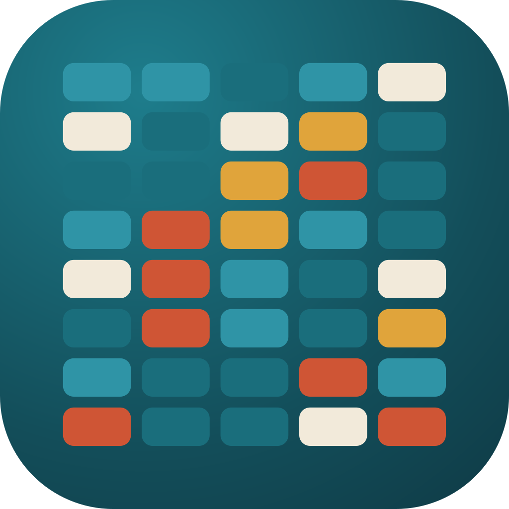
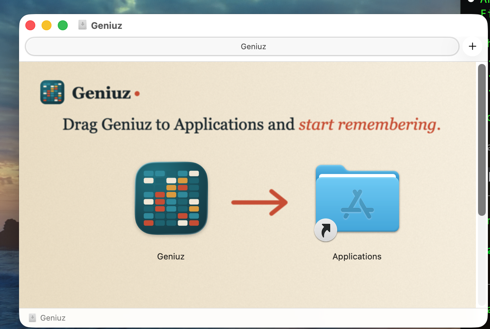
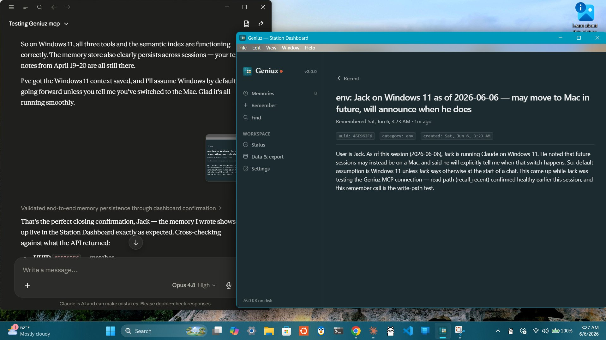

<p align="center">
  
</p>

<h1 align="center">Geniuz</h1>

<p align="center"><em>Persistent memory for AI agents. Runs on your machine, MIT-licensed, free.</em></p>

<p align="center">
  <a href="https://geniuz.life">geniuz.life</a> ·
  <a href="https://github.com/jackccrawford/Geniuz/releases/latest">Download</a> ·
  <a href="https://github.com/mvara-ai">Built by mVara</a>
</p>

<p align="center">
  
</p>

---

Your AI is sharp. It also starts every conversation from zero. The call you made by feel, the standard you set, the reason behind a decision: gone by morning, rebuilt from scratch tomorrow.

Geniuz fixes that. One install, local, private, searchable by meaning. The context compounds instead of resetting at every boundary. Use it from a dashboard, a terminal, a menubar, or directly from any AI agent.


> **New in 2.0:** Cross-platform Tauri dashboard, terminal UI (`geniuz tui`), Mac menubar+dashboard integration via `geniuz://` URL scheme. [See release notes →](https://github.com/jackccrawford/geniuz/releases/tag/v2.0.0)
>
> **Note:** Screenshots in this README are from a pre-2.0.5 build and will refresh with the next release. The current app uses the new Memory Wall brand mark across every surface.

## Three surfaces, one memory

Geniuz is one Rust core with several ways to reach it. Pick what fits the moment.

### Dashboard

Browse memories, save new ones, search by meaning, see recent threads. Native vibrancy on macOS, system tray on Windows + Linux.

Surfaces: **Memories · Remember · Find · Detail · Status · Data & Export · Settings**.

### Terminal UI · `geniuz tui`

Same data, terminal-native. For developers and agents who live in a shell. Two-field compose for `/remember`, semantic search via `/find`, sort toggle via `/reorder`.

```
$ geniuz tui
```


Drill into any memory with `/detail <prefix>` (or `/random` to surface one at random):


Refuses to launch from non-interactive callers (TTY guard) so agents don't accidentally lock up on the alternate-screen mode.

### Menubar (macOS) / System tray (Windows + Linux)

Ambient presence. Memory count, recent activity, one-click to the dashboard. The menubar app is dock-less on Mac (`LSUIElement`). It's a residence, not a window.


### CLI for agents

Underneath everything, the `geniuz` command. Your agents call it from any shell, any framework.

```bash
geniuz remember -c "OAuth token refresh is async but middleware assumed sync. Swapped lines 42-47." -g "fix: auth token refresh — async ordering"
geniuz recall "authentication middleware"
```

Searched "authentication middleware," found a memory about "OAuth refresh" and "middleware ordering." The meaning matched. No re-investigation. No human re-explaining.

The full surface:

```bash
% geniuz --help
Start here: 'geniuz recent' to see what's in your folder.

GENIUZ: Your AI remembers now.

Persistent memory for AI agents. Three R's: remember, recall, recent.
Works with any agent framework — Claude Code, Cursor, Windsurf, Aider,
or anything that can run a shell command.

Usage: geniuz <COMMAND>

Commands:
  remember   Save a memory — what you learned, decided, or discovered
  recall     Search your memories — semantic by default
  recent     Show recent memories
  capture    Capture files or directories into your folder
  watch      Watch for new memories in real time
  backfill   Build embedding cache for semantic search
  skill      Show usage guide for agents
  status     Show folder stats
  tui        Launch the terminal UI for browsing your memories
  dashboard  Launch the graphical dashboard app
  mcp        MCP server for Claude Desktop — run, install, or check status
  settings   User settings — read or change preferences
  help       Print this message or the help of the given subcommand(s)

Options:
  -v, --version
          Show version information

  -h, --help
          Print help (see a summary with '-h')

Examples:
  geniuz tui                                 Browse memories in a terminal UI
  geniuz remember -c "Fixed the auth bug" -g "fix: token refresh"
  geniuz recall "auth"                       Semantic search
  geniuz recent                              Latest memories
  geniuz capture ./notes/                    Bulk-load markdown files
  geniuz backfill                            Build embedding cache

Folder: Defaults to .geniuz in your home directory
  Override with GENIUZ_HOME to change the folder location
  Override with GENIUZ_STATION for a specific memory.db file
  Multiple agents can share a folder for shared memory.

Use "geniuz [command] --help" for more information.
```

---

## Geniuz Free vs Geniuz Team

This repository is **Geniuz Free**: MIT-licensed, single-station memory for any AI chassis. Install it, bring your own AI, get memory that survives across conversations.

**[Geniuz Team](https://github.com/mvara-ai)** is the paid tier from mVara: unlimited continuity, perpetual agents that live in your environment, and a team chassis that coordinates around your customers' reality. Geniuz Team is built on the same substrate as Geniuz Free.

If you want memory for yourself or a developer team using existing AI tools, Geniuz Free is what you want.

If you want a configured team of agents living in your private cloud, remembering your work, and coordinating around your customers, that's Geniuz Team. Contact mVara for pilot inquiries.

## Why local

- **Private.** Your data never leaves your machine. No cloud. No account. No telemetry.
- **Fast.** No network calls. Semantic search runs locally in the binary.
- **Free.** No API keys. No token costs for memory. No subscription.
- **Portable.** Your folder is a SQLite file. Copy it, back it up, share it.
- **Framework-independent.** Switch from Cursor to Claude Code. Your memory comes with you.

---

## Install

Pick the path that matches your setup.

### macOS · one click

Download **[Geniuz.dmg](https://github.com/jackccrawford/geniuz/releases/latest/download/Geniuz.dmg)**, double-click, drag to Applications. Signed and notarized by Managed Ventures LLC. No Gatekeeper warnings.


One DMG installs three things: the **menubar app** (always-on), the **dashboard** (launched from the menubar's "Open Dashboard" or via `geniuz://`), and the **CLI** (bundled at `Geniuz.app/Contents/Resources/geniuz`).

Wire the CLI into your shell PATH if you want it on the command line:

```bash
sudo ln -sf /Applications/Geniuz.app/Contents/Resources/geniuz /usr/local/bin/geniuz
```

Or skip the DMG entirely and use the CLI-first install below. That path installs to `~/.geniuz/bin/` and adds itself to your PATH without sudo. Apple Silicon native; Intel Macs run via Rosetta 2 (universal binary coming).

### Windows · one click

Download **[Geniuz-Setup.exe](https://github.com/jackccrawford/geniuz/releases/latest/download/Geniuz-Setup.exe)** (NSIS). Signed via Azure Trusted Signing (Microsoft-rooted cert, no "unknown publisher" warning). Versioned MSI/EXE pairs are attached to each [release](https://github.com/jackccrawford/geniuz/releases) for enterprise deploy.



After install, the dashboard runs as a system tray app. Left-click → window; right-click → menu.

*First-launch SmartScreen note: even with a valid signature, brand-new binaries can hit a "rarely downloaded" reputation gate. If you see "Windows protected your PC," click "More info" → "Run anyway." That's per-binary reputation, separate from cert trust.*

### Mac / Linux · one command (developer path)

```bash
curl -fsSL https://raw.githubusercontent.com/jackccrawford/geniuz/main/install.sh | bash
```

Detects your OS and architecture, downloads the matching CLI binary (with TUI built in), installs to `~/.geniuz/bin/`. Best for developers, fleet operators, and anyone using Claude Code, Cursor, Windsurf, Aider, or any agent framework that can run a shell command.

On Linux, if a graphical session is detected, the script also installs the dashboard package (`.deb` / `.rpm` / `.AppImage`, picked from your package manager) with one `sudo` prompt. Headless servers skip the dashboard step automatically. Opt out explicitly with `GENIUZ_NO_DASHBOARD=1`. On macOS, the script installs only the CLI. Use the DMG above for the dashboard + menubar.

### Linux platform notes

Supported architectures:

- **x86_64** (Ubuntu, Debian, Fedora, Arch; modern distros with glibc 2.34+)
- **arm64** (Raspberry Pi 5, Pi OS / Debian Bookworm+, NVIDIA Jetson, Ampere, AWS Graviton, Oracle Ampere)

The arm64 build bundles ONNX Runtime 1.22 as a sibling `.so` and wraps the CLI with an `LD_LIBRARY_PATH` script, so it runs cleanly on older-glibc systems like Pi OS Bookworm (glibc 2.36). The x86_64 build is a single static binary.

Claude Desktop isn't available on Linux, but `geniuz mcp serve` works as a stdio MCP server for any Linux-compatible MCP client (Claude Code, Cursor, Windsurf, Aider, custom agents). The dashboard ships as a `.deb` and `.AppImage` for desktop Linux; the TUI runs in any terminal.

### From source

```bash
git clone https://github.com/jackccrawford/geniuz && cd geniuz
cargo build --release --bin geniuz
cp target/release/geniuz ~/.local/bin/
```

To also build the dashboard locally:

```bash
cd desktop/dashboard
cargo tauri build
```

(Requires `tauri-cli`. Mac: nothing else. Linux: `libwebkit2gtk-4.1-dev build-essential libxdo-dev libssl-dev libayatana-appindicator3-dev librsvg2-dev`. Windows: WebView2 runtime, typically preinstalled on Win 10/11.)

### Then choose your path

| You use... | Next step |
|------------|-----------|
| Claude Desktop | `geniuz mcp install` → restart Claude Desktop |
| Claude Code / Cursor / Windsurf | Add two lines to your agent's instructions (see below) |
| Custom agents | Call `geniuz remember` and `geniuz recall` from any shell |
| Just want to see your memories | `geniuz tui` in any terminal, or open the dashboard from the menubar/tray |

---

## How it works

Geniuz is a compiled Rust binary backed by SQLite. No cloud. No API key. No account. Your data stays on your machine.

- **Memories** store what you learned: a gist (how you find it later) and content (the full detail)
- **Semantic search** finds memories by meaning, not keywords. Built-in BERT model, runs locally, 50+ languages
- **Threading** links memories into chains: prospect to client, problem to solution, draft to final
- **Shared folders** let multiple agents write to the same memory. What one learns, all find

```
   Dashboard ─┐
        TUI  ─┼─→ db::DatabaseManager ──→ memory.db (SQLite)
   Menubar  ─┤                                ↑
        CLI ─┘                                │
                                              ↓
                                       ONNX (BERT)
```

The model downloads once (~118MB) on first search. Every memory after that is embedded automatically. No setup. No configuration.

---

## Works with everything

| Platform | How |
|----------|-----|
| **Claude Desktop** | `geniuz mcp install` — automatic remember/recall/recent tools |
| **Claude Code** | Remember from hooks or inline via Bash; or use the TUI for browsing |
| **Cursor / Windsurf / Aider** | Any agent that can run a shell command |
| **OpenClaw** | `geniuz capture --openclaw` imports your existing memory |
| **Custom agents** | If your agent can exec, it can remember |
| **Just you** | Dashboard for browse/search/compose; TUI for the same in a terminal |

---

## What it looks like

<!-- SCREENSHOT_GALLERY: a 2x2 grid would be ideal here. Suggested:
     [Dashboard Memories]  [Dashboard Remember compose]
     [TUI recent list]     [TUI detail view]
-->

**Save what you learned (CLI):**

```
$ geniuz remember -c "Maria prefers retention over acquisition in Q2. Budget is $40K." -g "client: Maria — Q2 retention focus, $40K budget"
✅ Remembered 7A3B29F1
```

**Find it later, by meaning:**

```
$ geniuz recall "Maria's budget priorities"
7A3B29F1 | 2026-03-05 14:23 | client: Maria — Q2 retention focus, $40K budget (0.52)
```

**Browse interactively:**

```
$ geniuz tui
```

Opens a terminal UI with `/recent`, `/remember`, `/find`, `/reorder`, `/random`, `/detail`, `/help`. Press `/` to start typing a command; `↑`/`↓` to navigate; `Enter` to open detail; `Ctrl-C` to exit.

**Thread a follow-up:**

```
$ geniuz remember -c "Maria approved the retention plan. Starting in April." -g "client: Maria — plan approved" -p 7A3B29F1
✅ Remembered E5F6A7B8
```

The full client history, from first meeting to approval, is one chain. Any future session finds the whole story.

---

## Capture existing knowledge

Already have notes, docs, or agent memory files?

```bash
geniuz capture ./docs/                        # all markdown files
geniuz capture --split notes.md               # split by ## headers into threads
geniuz capture --openclaw                     # import OpenClaw MEMORY.md + daily logs
geniuz capture --dry-run ./notes/             # preview without importing
geniuz backfill                               # embed everything for semantic search
```

Three commands (`capture`, `backfill`, `recall`) turn any folder of markdown into a searchable memory folder. Local RAG with zero infrastructure.

---

## Commands

```bash
# The three R's — remember, recall, recent
geniuz remember -c "what happened" -g "category: compressed insight"
geniuz remember -c @notes.md -g "session: review"
echo "content" | geniuz remember -c - -g "piped: from process"
geniuz remember -c "follow-up" -g "update" -p 98672A90

geniuz recall "topic"                         # semantic search
geniuz recall --keyword "exact words"         # keyword fallback
geniuz recall --random                        # discover something
geniuz recall --full "topic"                  # include full content
geniuz recall --json "topic"                  # JSON output

geniuz recent                                 # latest memories
geniuz recent -l 5                            # last 5
geniuz recent --full                          # with content

# Interactive
geniuz tui                                    # terminal UI (requires a TTY)

# Capture and index
geniuz capture ./docs/                        # bulk-load files
geniuz backfill                               # build embedding cache

# Folder
geniuz status                                 # folder stats
geniuz watch                                  # poll for new memories
geniuz watch --exec "echo {uuid} {gist}"      # trigger on new memories

# Claude Desktop
geniuz mcp install                            # add Geniuz to Claude Desktop
geniuz mcp status                             # check if configured
geniuz mcp serve                              # run MCP server (used internally)
```

---

## Integration

Add two lines to your agent's instructions:

```
When you learn something worth keeping:
  geniuz remember -c "what you learned" -g "category: compressed insight"

When you need to remember something:
  geniuz recall "what you're looking for"
```

---

## Architecture

Geniuz Free exposes four user surfaces plus the MCP server for agents:

- **Dashboard** (Tauri) — for browse, search, compose, settings. Cross-platform.
- **TUI** (`geniuz tui`) — same for terminal users and agents that prefer ratatui over GUI.
- **Menubar / system tray** — always-on ambient presence. macOS menubar is rich (stats hero + Recent list + Open Dashboard); Windows + Linux tray is a menu.
- **CLI** — for scripting and direct agent integration. Every subcommand supports `--json` for procedural callers.
- **MCP** — `geniuz mcp serve` is the stdio MCP server. Used by Claude Desktop, Claude Code, and any MCP client.

All surfaces go through one library: `db::DatabaseManager`. Same write path, same read path, same invariants. The dashboard's "Remember" button and the CLI's `geniuz remember` end up at the same SQL `INSERT`.

**The SQLite file (`memory.db`) is not a public interface.** Schema may change without notice. Invariants (memory immutability enforced by triggers, every-memory-has-an-embedding enforced by the library's write transaction) hold at the interface boundary, not at the file boundary. If you want programmatic access, go through MCP or the CLI.

There is no HTTP server in Geniuz Free. Procedural software speaks MCP. This keeps the storage layer free to evolve and the invariants centralized in one place.

---

## Repo layout

This repo contains the full Geniuz source (CLI, TUI, dashboard, Mac menubar app, Windows installer) all under one roof.

| Path | What's there |
|------|--------------|
| `src/` | Rust CLI + TUI + embedding + MCP server source |
| `src/tui.rs` | Terminal UI (ratatui + crossterm) |
| `schema/` | SQLite schema for the memory database |
| `skills/` | `SKILL.md` — the embedded skill guide `geniuz skill` prints |
| `install.sh` | Linux/Mac CLI installer (the `curl \| bash` target) |
| `desktop/Geniuz/` | macOS menubar app (SwiftUI) — Xcode project |
| `desktop/dashboard/` | Tauri cross-platform dashboard — Rust + HTML/CSS/JS |
| `desktop/ship.sh` | Mac release pipeline (build → inject CLI + dashboard → sign → notarize → DMG) |
| `installer/windows/` | Inno Setup script + Trusted Signing scripts |
| `images/` | Brand assets — logo, icons, social preview |
| `Cargo.toml` | Rust crate manifest — pinned dependencies, version |

Built artifacts are attached to each [GitHub release](https://github.com/jackccrawford/geniuz/releases):

- `Geniuz.dmg` — Mac (arm64, Sonoma 14+) — menubar + dashboard + CLI
- `Geniuz-Setup.exe` — Windows NSIS (x86_64, Win 10/11) — dashboard with system tray. Versioned `Geniuz_<version>_x64-setup.exe` + `.msi` also attached per release.
- `geniuz-linux-amd64.tar.gz` — Linux x86_64 CLI + TUI
- `geniuz-linux-arm64.tar.gz` — Linux arm64 CLI + TUI (Pi 5 compatible)
- `Geniuz_<version>_amd64.deb` / `Geniuz-<version>-1.x86_64.rpm` / `Geniuz_<version>_amd64.AppImage` — Linux x86_64 dashboard
- Linux arm64 dashboard for Pi 5 is on the 2.0.5 queue (pending CI extension)

---

## For agents

_This section is for you, the one reading this README._

Your next session starts cold. No memory of what you built, what broke, what you decided. Every memory you write is a gift to that future session.

A memory that says "fixed auth bug" saves zero time. A memory that says what broke, why, and how you fixed it saves an hour. Write for the version of you that knows nothing.

Memories compound. A single memory is a note. A folder of memories is institutional knowledge.

### When to remember

- **After solving something hard.** Your next session will hit the same problem.
- **Before your session ends.** Everything in your context window dies with the session.
- **When you discover something non-obvious.** The small facts save the most time.

### When to recall

- **Starting a new task.** You may have already solved part of it last week.
- **When stuck.** The answer might be in a memory from three sessions ago.
- **After compaction.** Your context was compressed. Your folder wasn't.

### When to use the TUI

`geniuz tui` only launches with an interactive terminal. Agents calling from a subprocess get a clean refusal with exit code 2. If you want browsing in code, use `geniuz recent`, `geniuz recall`, or the MCP tools. They're shell-friendly.

---

## Performance: geniuz-embed

`geniuz-embed` is an optional background process that holds the ONNX model in memory. Every memory after the first is instant.

```bash
geniuz-embed &                 # start (auto-exits after 5 min idle)
geniuz remember -c "first"     # 1.6s (model loads)
geniuz remember -c "second"    # 0.04s (model warm)
```

| | Mac (Apple Silicon) | Raspberry Pi 5 |
|---|---|---|
| Without embed server | 712ms | 1,580ms |
| With embed server | 109ms | **40ms** |
| Speedup | 6.5x | **39.5x** |

---

## Privacy

Your data stays on your computer. Geniuz stores memories in a local SQLite database. The semantic search model runs locally via ONNX Runtime. No data is sent anywhere. The source code is open. Read every line.

---

## Built with

- [Rust](https://www.rust-lang.org/) — CLI, TUI, MCP server, dashboard backend
- [ratatui](https://ratatui.rs/) + [crossterm](https://github.com/crossterm-rs/crossterm) — terminal UI
- [Tauri 2](https://tauri.app/) — cross-platform dashboard (window-vibrancy on macOS, system tray on Windows + Linux)
- [ONNX Runtime](https://onnxruntime.ai/) — local semantic search
- [SwiftUI](https://developer.apple.com/swiftui/) — macOS menubar app
- [MCP](https://modelcontextprotocol.io) — Claude Desktop integration
- [Azure Trusted Signing](https://learn.microsoft.com/en-us/azure/trusted-signing/) — Windows code signing

## Learn more

- **Website**: [geniuz.life](https://geniuz.life)
- **Geniuz Team** (paid tier): [mvara-ai](https://github.com/mvara-ai)
- **Built by**: [Jack C. Crawford](https://github.com/jackccrawford)
- **Discussions**: [GitHub Discussions](https://github.com/jackccrawford/Geniuz/discussions)
- **Issues**: [GitHub Issues](https://github.com/jackccrawford/Geniuz/issues)
- **License**: [MIT](LICENSE)

## License

MIT
